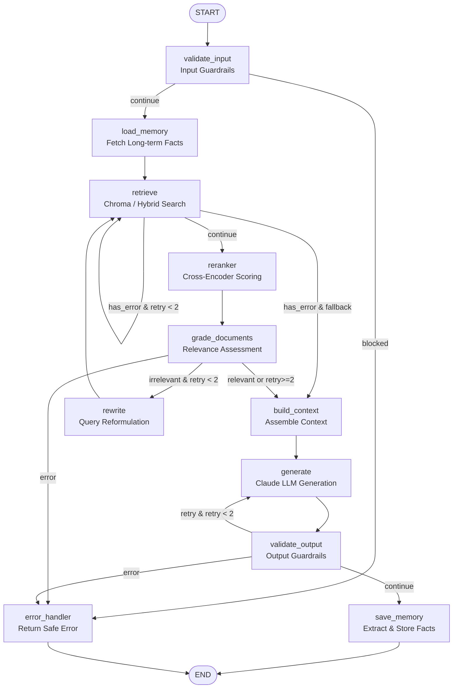

# RAG API — Project Overview & Architecture Workflow

## Stack
| Layer | Technology |
|---|---|
| **API** | FastAPI (REST + Server-Sent Events / SSE Streaming) |
| **RAG Orchestration** | LangGraph (Corrective RAG with self-correction, document grading, query rewriting) |
| **Guardrails Framework** | Multi-tiered Input & Output Guardrail Services |
| **Guardrail Providers** | NVIDIA NeMo Guardrails, Meta Llama Guard 3, Microsoft Presidio |
| **Vector Store** | ChromaDB (Cosine similarity) |
| **Keyword Search** | SQLite FTS5 (BM25 keyword search) |
| **Hybrid Search** | Reciprocal Rank Fusion (RRF, k=60) + Cross-Encoder Reranker |
| **Embeddings** | HuggingFace Sentence Transformers (`all-MiniLM-L6-v2`) |
| **Reranker** | Cross-Encoder (`ms-marco-MiniLM-L-6-v2`) |
| **LLM Provider** | Anthropic Claude (`claude-3-5-sonnet-20241022`) |
| **Conversation Memory** | LangGraph `SqliteSaver` (checkpointing `rag_database.db`) |
| **Long-Term Memory** | LLM-driven `MemoryExtractor` + `MemoryService` (user facts stored in SQLite) |
| **Async Background Tasks** | Celery + Redis (asynchronous document ingestion) |
| **Auth** | JWT (Bearer token with password hashing via bcrypt) |

---

## Project Structure

```
basic_rag/
├── main.py                              # App factory, lifespan, and router registration
├── PROJECT_WORKFLOW.md                  # Comprehensive architecture and workflow documentation
├── database/
│   └── sqlite.py                       # SQLite connection pool, schema initialization, get_db()
├── frontend/                           # Streamlit UI application
└── app/
    ├── api/
    │   ├── auth.py                      # POST /auth/register, /auth/login, GET /auth/me
    │   ├── documents.py                 # POST /documents/ingest, GET /documents, DELETE /documents/{id}
    │   ├── query.py                     # POST /query/, /query/hybrid, /query/stream, GET /query/conversations
    │   └── dependencies.py              # Dependency injection: RAG graphs, vector store, guardrails
    ├── core/
    │   ├── config.py                    # Pydantic Settings (.env configuration)
    │   ├── exceptions.py                # Global and node-level exception handlers
    │   └── logger.py                    # Structured logging setup
    ├── guardrails/
    │   ├── base.py                      # BaseInputGuardrail, BaseOutputGuardrail, GuardrailResult
    │   ├── factory.py                   # build_input_guardrails(), build_output_guardrails()
    │   ├── input_service.py             # InputGuardrailService (pipeline orchestrator)
    │   ├── output_service.py            # OutputGuardrailService (pipeline orchestrator)
    │   ├── provider/
    │   │   ├── llama_guard.py           # Meta Llama Guard 3 provider (input & output safety)
    │   │   ├── nemo.py                  # NeMo Guardrails provider (prompt injection & rails)
    │   │   └── presidio.py              # Microsoft Presidio provider (PII detection & anonymization)
    │   ├── input/
    │   │   ├── injection.py             # Prompt injection detection (regex heuristics & NeMo)
    │   │   ├── pii.py                   # Input PII detection guardrail (Presidio)
    │   │   ├── safety.py                # Input safety guardrail (Llama Guard)
    │   │   └── validation.py            # Input length and character validation
    │   └── output/
    │       ├── grounding.py             # Hallucination / grounding score evaluation
    │       ├── pii.py                   # Output PII leakage check & anonymization
    │       ├── safety.py                # Output safety guardrail (Llama Guard)
    │       └── schema.py                # JSON / Pydantic schema validation guardrail
    ├── memory/
    │   ├── extractor.py                 # LLM memory extraction (ADD / UPDATE / NOOP decisions)
    │   ├── models.py                    # Memory schemas and data models
    │   └── service.py                   # SQLite memory persistence service
    ├── models/
    │   └── schemas.py                   # Pydantic request and response schemas
    ├── prompts/
    │   └── memory_prompts.py            # Long-term memory extraction prompts
    ├── tasks/
    │   ├── celery_app.py                # Celery worker initialization
    │   └── tasks.py                     # Background ingestion task definitions
    └── services/
        ├── auth/                        # JWT issuance, hashing, security dependencies
        ├── ingestion/                   # Document loader, chunker, embedder, IngestionPipeline
        ├── llm/
        │   └── claude.py                # Anthropic Claude client (completion & token streaming)
        ├── rag/
        │   ├── state.py                 # RAGState TypedDict definition
        │   ├── nodes.py                 # Node implementations (guardrails, retrieval, generation)
        │   ├── edge.py                  # Conditional edge routers (grading, guardrails, errors)
        │   └── graph.py                 # StateGraph builder and compilation
        ├── retriever/
        │   ├── base.py                  # BaseRetriever abstract class
        │   ├── dense.py                 # ChromaDB dense vector retriever
        │   ├── bm25.py                  # SQLite FTS5 BM25 keyword retriever
        │   ├── hybrid.py                # Hybrid retriever with Reciprocal Rank Fusion (RRF)
        │   ├── reranker.py              # Cross-Encoder re-scoring
        │   └── context.py               # Context formatting and builder
        └── vectorstore/
            └── chroma.py                # ChromaDB persistent client wrapper
```

---

## Guardrails Architecture

The guardrails system operates as a bi-directional safety and compliance boundary surrounding the RAG pipeline:

```
User Query
    │
    ▼
┌─────────────────────────────────────────────────────────────┐
│                   Input Guardrail Service                   │
├─────────────────────────────────────────────────────────────┤
│ 1. InputValidationGuardrail  → Length & format constraints   │
│ 2. PromptInjectionGuardrail  → Heuristics + NeMo Guardrails │
│ 3. PresidioPIIGuardrail      → Sensitive data detection     │
│ 4. InputSafetyGuardrail      → Meta Llama Guard 3 policy    │
└─────────────────────────────────────────────────────────────┘
    │ (Allowed)                                  │ (Blocked)
    ▼                                            ▼
RAG StateGraph Processing                   Error Handler
    │
    ▼
LLM Generation (Claude)
    │
    ▼
┌─────────────────────────────────────────────────────────────┐
│                  Output Guardrail Service                   │
├─────────────────────────────────────────────────────────────┤
│ 1. OutputSchemaGuardrail     → JSON / Pydantic validation   │
│ 2. GroundingGuardrail        → Hallucination / context check│
│ 3. OutputPIIGuardrail        → PII leakage prevention       │
│ 4. OutputSafetyGuardrail     → Meta Llama Guard 3 check     │
└─────────────────────────────────────────────────────────────┘
    │ (Passed / Sanitized)                       │ (Violated)
    ▼                                            ▼
Save Memory & Return Response               Retry Generation / Error
```

### Providers
- **`NeMoProvider`**: Interacts with NeMo Guardrails (`LLMRails`) to detect jailbreaks, prompt injections, and off-topic queries.
- **`PresidioProvider`**: Utilizes Microsoft Presidio `AnalyzerEngine` and `AnonymizerEngine` with spaCy (`en_core_web_sm`) to flag and redact PII entities (names, emails, SSNs, credit cards).
- **`LlamaGuardProvider`**: Uses Meta Llama Guard 3 (8B) via HuggingFace `AutoModelForCausalLM` to validate both user queries and assistant responses against safety taxonomies.

---

## Complete RAG Graph Workflow (LangGraph)



---

## Key Flows

### 1. Document Ingestion
```
POST /documents/ingest (Sync or Async via Celery)
  → IngestionPipeline.ingest()
      → Load (PDF, TXT, DOCX, MD)
      → Clean & Normalize
      → Recursive Chunking with Overlap
      → Embed via HuggingFace (SentenceTransformers)
      → ChromaDB.add() + BM25 SQLite FTS5 index update
      → Record metadata in SQLite (documents table)
```

### 2. Standard Query (`POST /query/` and `POST /query/hybrid`)
```
POST /query/ or /query/hybrid
  → Input Guardrail checks (Length, Injection, PII, Safety)
  → Load long-term memory & conversation thread history
  → Dense or Hybrid Retrieval (ChromaDB + BM25 with RRF)
  → Cross-Encoder Reranking
  → Corrective Document Grading (Rewrite query if low relevance)
  → Context Assembly & Prompt Construction
  → Claude LLM Generation
  → Output Guardrail checks (Schema, Grounding, PII Anonymization, Safety)
  → Dynamic Long-term Memory Extraction & SQLite update
  → Save session checkpoint via SqliteSaver
```

### 3. Token-by-Token Streaming (`POST /query/stream`)
```
POST /query/stream
  → Runs Retrieval & Memory phase through graph
  → Passes assembled context and chat history to Claude streaming generator
  → Yields Server-Sent Events (SSE):
      - data: {"type": "token", "content": "..."}
      - data: {"type": "done", "session_id": "...", "answer": "..."}
      - data: {"type": "error", "error": "..."}
```

### 4. Conversation History Management
```
GET /query/conversations           → List all session IDs for authenticated user
GET /query/conversations/{id}      → Retrieve full turn-by-turn chat history
```

---

## Environment Variables (`.env`)

| Key | Description | Default |
|---|---|---|
| `ANTHROPIC_API_KEY` | Anthropic Claude API key | Required |
| `LANGSMITH_API_KEY` | LangSmith tracing key (optional) | None |
| `EMBEDDING_MODEL` | HuggingFace embedding model | `all-MiniLM-L6-v2` |
| `RERANKER_MODEL` | Cross-encoder reranker model | `cross-encoder/ms-marco-MiniLM-L-6-v2` |
| `CHROMA_PERSIST_DIR` | Directory for persistent vector store | `./data/chroma` |
| `DATABASE_URL` | SQLite database path | `sqlite:///rag_database.db` |
| `JWT_SECRET` | Secret key for signing auth tokens | Required |
| `JWT_ALGORITHM` | JWT signing algorithm | `HS256` |
| `CELERY_BROKER_URL` | Celery broker URL (Redis) | `redis://localhost:6379/0` |
| `CELERY_RESULT_BACKEND` | Celery backend result URL | `redis://localhost:6379/0` |

---

## Running Locally

```bash
# 1. Install dependencies
pip install -r requirements.txt
python -m spacy download en_core_web_sm

# 2. Run Redis (required for Celery async tasks)
redis-server

# 3. Start Celery worker (optional, for async ingestion)
celery -A app.tasks.celery_app worker --loglevel=info

# 4. Start the FastAPI API server
uvicorn main:app --reload --host 0.0.0.0 --port 8000

# 5. Start the Streamlit frontend (optional)
streamlit run frontend/app.py

# Interactive API Documentation
# Swagger UI: http://localhost:8000/docs
# ReDoc:      http://localhost:8000/redoc
```
