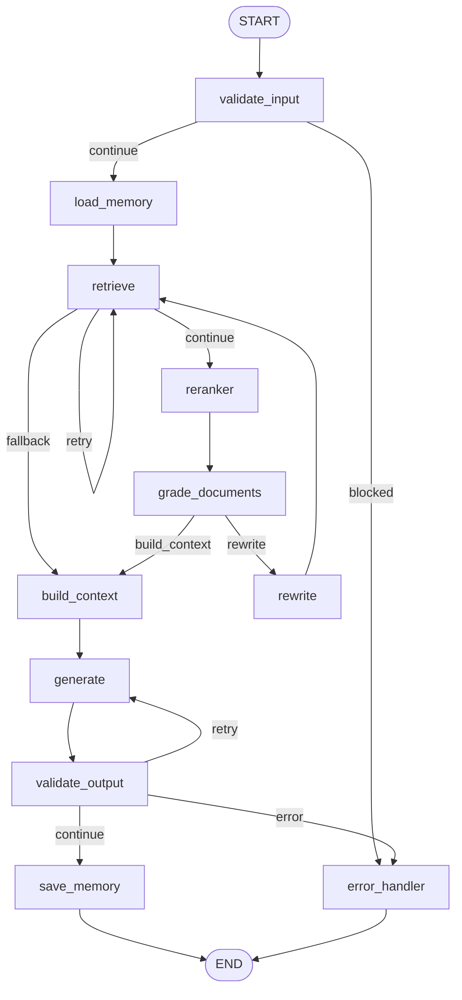

# RAG API — Project Overview & Architecture Workflow

This document describes the **current** application: one chat pipeline (multi-agent supervisor over hybrid retrieval), JWT auth, Streamlit UI, and document ingestion. It is not a roadmap.

## Stack

| Layer | Technology |
|---|---|
| **API** | FastAPI (`main.py`) — REST + SSE on `POST /chat/` |
| **UI** | Streamlit (`frontend/`) — login, upload, chat |
| **Orchestration** | LangGraph master graph (`app/agent/multi_agent/`) — supervisor + specialists |
| **RAG specialist** | Nested LangGraph CRAG graph (`app/services/rag/`) — hybrid retrieve → rerank → grade → rewrite → generate |
| **Vector store** | ChromaDB (cosine / HNSW), persist dir `data/chroma_db` |
| **Keyword search** | SQLite FTS5 BM25 (`data/bm25.db`) |
| **Hybrid search** | Reciprocal Rank Fusion (RRF, `k=60`) then cross-encoder rerank |
| **Embeddings** | HuggingFace Sentence Transformers (`sentence-transformers/all-MiniLM-L6-v2`) |
| **Reranker** | Cross-encoder (`cross-encoder/ms-marco-MiniLM-L-6-v2`) |
| **LLM** | Anthropic Claude (`ANTHROPIC_MODEL`, default `claude-sonnet-4-5`) |
| **Conversation memory** | LangGraph `AsyncSqliteSaver` on `rag_database.db` (`thread_id` = `session_<uuid>`) |
| **Long-term memory** | `MemoryExtractor` + `MemoryService` → SQLite `user_memories` |
| **Auth users / docs** | SQLite (`users`, `documents`) via SQLAlchemy — not MySQL at runtime |
| **Auth** | JWT Bearer (`JWT_SECRET_KEY`, bcrypt hashes) |
| **Async ingest (optional)** | Celery + Redis when `IS_ASYNC=true` |
| **Guardrails** | Input/output services; at runtime input validation always runs, NeMo injection when enabled and ready |

There is **no** public `/query/`, `/query/hybrid`, or `/query/stream` path and **no** chat mode switch. The RAG graph is only invoked as the `rag_agent` specialist.

---

## Project Structure

```
basic_rag/
├── main.py                              # FastAPI app, lifespan (init_db + HF token + model warmup)
├── run.py                               # Starts uvicorn + Streamlit together
├── PROJECT_WORKFLOW.md                  # This file
├── database/
│   ├── sqlite.py                        # Engine, SessionLocal, init_db(), get_db()
│   └── models.py                        # User, Document, MemoryRecord
├── frontend/
│   ├── app.py                           # Streamlit entry
│   ├── api_client.py                    # HTTP client (JWT + POST /chat/ SSE)
│   └── components/
│       ├── auth_ui.py
│       ├── chat_ui.py
│       └── sidebar_ui.py
└── app/
    ├── api/
    │   ├── auth.py                      # POST /auth/register, /auth/login, GET /auth/me
    │   ├── documents.py                 # POST /ingest, GET /documents, download, DELETE
    │   ├── query.py                     # POST /chat/, GET /chat/conversations[/{id}]
    │   ├── session_access.py            # Checkpoint thread ownership
    │   └── dependencies.py              # Graphs, retriever, LLM, tools, checkpointer
    ├── agent/multi_agent/
    │   ├── master_graph.py              # Supervisor StateGraph
    │   ├── supervisor.py                # Route + synthesize
    │   ├── route.py                     # Cheap (non-LLM) first-pass routing
    │   ├── nodes.py                     # Guardrails, memory, RAG/SQL/web/general
    │   └── state.py                     # SupervisorState
    ├── core/
    │   ├── config.py                    # Settings from .env
    │   ├── exceptions.py
    │   ├── logger.py
    │   └── device.py                    # Torch device for embeddings/reranker
    ├── guardrails/
    │   ├── factory.py                   # Wires optional providers into services
    │   ├── input_service.py / output_service.py
    │   ├── fast_checks.py               # Skip NeMo on ordinary questions
    │   ├── nemo_config/                 # NeMo rails config when ENABLE_NEMO=true
    │   ├── provider/                    # nemo.py, presidio.py, llama_guard.py
    │   ├── input/                       # validation, injection, pii, safety
    │   └── output/                      # schema, grounding, pii, safety
    ├── memory/
    │   ├── extractor.py                 # ADD / UPDATE / NOOP
    │   ├── persist.py                   # Background persist after a turn
    │   ├── service.py
    │   └── models.py
    ├── models/schemas.py                # ChatRequest, auth, documents
    ├── prompts/memory_prompts.py
    ├── tasks/                           # Celery ingest (used only if IS_ASYNC)
    ├── tools/
    │   ├── registry.py                  # document_search, web_search, sql_*
    │   ├── doc_search.py
    │   ├── web_search.py                # Tavily if TAVILY_API_KEY else DuckDuckGo
    │   └── sql_search.py                # Read-only SQLite schema + SELECT
    └── services/
        ├── auth/
        ├── ingestion/                   # loader, cleaner, chunker, embedder, pipeline
        ├── llm/claude.py
        ├── rag/                         # Nested CRAG graph used by rag_agent
        ├── retriever/                   # dense, bm25, hybrid RRF, reranker, context
        └── vectorstore/chroma.py
```

---

## Chat API behaviour

### `POST /chat/` (also `POST /chat`)

JWT required. Body: `{ "question": "...", "session_id": "session_<uuid>" | null }`.

1. Empty question → HTTP 400.
2. Existing `session_id` must belong to the caller (`ensure_session_owner`); otherwise 404.
3. Missing `session_id` → new id `session_<uuid>`.
4. Response is **SSE** (`text/event-stream`):
   - immediate `: keepalive` so the UI is not stuck on a cold start
   - `data: {"type": "token", "content": "<full answer>"}` — one event with the completed answer (not token-by-token)
   - `data: {"type": "done", "session_id", "question", "answer", "iterations", "agent_trajectory", "guardrail_metadata"}`
   - or `data: {"type": "error", "error": "..."}`

Graph invoke caps: `iterations=0`, `max_iterations=2`.

### Conversations

```
GET /chat/conversations              → session ids owned by the JWT user
GET /chat/conversations/{session_id} → messages from the LangGraph checkpoint
```

History is read with `SqliteSaver` from `rag_database.db` (`chat_history` or `messages` channel).

---

## Master graph (the only chat pipeline)


### Routing

1. Each turn clears prior specialist outputs (`__reset__`) so the previous answer cannot leak.
2. `route.next_agent()` runs first:
   - If a specialist already ran this turn → `FINISH`.
   - Keyword hints pick `rag_agent` / `sql_agent` / `web_agent`.
   - Ambiguous multi-hint queries return `None` → LLM structured `SupervisorDecision`.
   - Otherwise `general_agent`.
3. After `max_iterations`, supervisor forces `FINISH`.
4. `synthesize`: if exactly one specialist returned text, that text is the answer; otherwise Claude merges observations.

### Specialists

| Node | What it does |
|---|---|
| **rag_agent** | Nested hybrid CRAG graph (`skip_memory_persist=True`). Fallback: `document_search` tool. Retrieval is filtered by `user_id`. |
| **sql_agent** | `sql_db_schema` → Claude writes a SELECT → `sql_db_query` → summary |
| **web_agent** | `web_search` then Claude answers from those results only |
| **general_agent** | Direct Claude, with loaded long-term facts in the system prompt |

---

## Nested RAG graph (`rag_agent` only)

Hybrid retriever: dense (Chroma, cosine) + BM25 FTS5 → RRF (`k=60`) → cross-encoder → document grading → optional query rewrite (retry cap in edges) → context → Claude.



When nested under the master agent, `skip_memory_persist` skips RAG-level fact extraction; the master `save_memory` node persists once.

---

## Guardrails (runtime wiring)

Code supports validation, NeMo injection, Presidio PII, Llama Guard, schema, and grounding.

**What `dependencies.py` actually wires today:**

- **Input:** `InputValidationGuardrail` (max 10k chars) always. `PromptInjectionGuardrail` only if `ENABLE_NEMO=true` and `NeMoProvider.is_ready`. Presidio and Llama Guard are **not** passed in, so those input checks are skipped.
- **Output:** `build_output_guardrails()` is called with no providers, so schema / grounding / PII / safety output checks are **skipped** unless you pass providers later.

NeMo injection uses `needs_llm_injection_check` so ordinary questions do not pay a NeMo LLM round-trip.

---

## Other HTTP flows

### Auth

```
POST /auth/register   JSON {username, email, password} → TokenResponse
POST /auth/login      OAuth2 form: username = email, password
GET  /auth/me         JWT → UserInDB
```

Users live in SQLite `users`. `Settings` still has unused MySQL fields.

### Documents

Uploads are stored under `documents/{user_id}/{document_id}{ext}`. Chunks get `user_id` / `document_id` / `filename` metadata.

```
POST /ingest                         sync pipeline, or Celery if IS_ASYNC=true
GET  /tasks/{task_id}                Celery status (async only)
GET  /documents                      list current user's rows
GET  /documents/download/{id}        original file
DELETE /documents/{id}               Chroma chunks + SQLite row + file
```

Loader extensions: `.txt`, `.pdf`, `.md`, `.csv`, `.json`. Chunking: LangChain recursive (`CHUNK_SIZE=1000`, `CHUNK_OVERLAP=200`).

---

## Streamlit UX

1. Unauthenticated → register / login.
2. Authenticated → sidebar (sessions, logout, ingest) + chat.
3. Chat calls `POST /chat/` with Bearer JWT and the current `session_id`.
4. Session ids stay `session_<uuid>` from the `done` event.

---

## Environment variables (`.env`)

| Key | Role | Typical / default |
|---|---|---|
| `ANTHROPIC_API_KEY` | Claude | required for generation |
| `ANTHROPIC_MODEL` | Claude model id | `claude-sonnet-4-5` |
| `HF_TOKEN` / `HUGGING_FACE_HUB_TOKEN` | Hugging Face downloads | optional |
| `EMBEDDING_MODEL` | Sentence transformer | `sentence-transformers/all-MiniLM-L6-v2` |
| `EMBEDDING_DEVICE` | Torch device | auto via `device.py` |
| `RERANKER_MODEL` | Cross-encoder | `cross-encoder/ms-marco-MiniLM-L-6-v2` |
| `CHROMA_PERSIST_DIRECTORY` | Local Chroma | `data/chroma_db` |
| `CHROMA_HOST` / `CHROMA_PORT` | Remote Chroma if set | unset → persistent client |
| `JWT_SECRET_KEY` | Token signing | required in production |
| `JWT_ALGORITHM` | | `HS256` |
| `JWT_EXPIRE_MINUTES` | | `60` |
| `DENSE_TOP_K` / `BM25_TOP_K` / `FUSION_TOP_K` | Retrieve sizes | `20` |
| `RERANK_TOP_K` | After rerank | `5` |
| `CHUNK_SIZE` / `CHUNK_OVERLAP` | | `1000` / `200` |
| `IS_ASYNC` | Celery ingest | `false` |
| `REDIS_URL` | Celery broker/backend | `redis://localhost:6379/0` |
| `ENABLE_NEMO` | Input injection rails | `true` |
| `NEMO_CONFIG_PATH` | | `app/guardrails/nemo_config` |
| `TAVILY_API_KEY` | Web search preferred | optional (else DuckDuckGo) |
| `LANGSMITH_*` | Tracing | optional |

SQLite app DB path is fixed: `rag_database.db`. BM25 index: `data/bm25.db`.

---

## Running locally

```bash
pip install -r requirements.txt

# Optional: NeMo / spaCy if you enable those providers
# python -m spacy download en_core_web_sm

# API + UI
python run.py
# API  http://localhost:8000  (docs: /docs)
# UI   http://localhost:8501

# Or separately:
uvicorn main:app --reload --host 0.0.0.0 --port 8000
streamlit run frontend/app.py

# Async ingest only
# redis-server
# celery -A app.tasks.celery_app worker --loglevel=info
```
